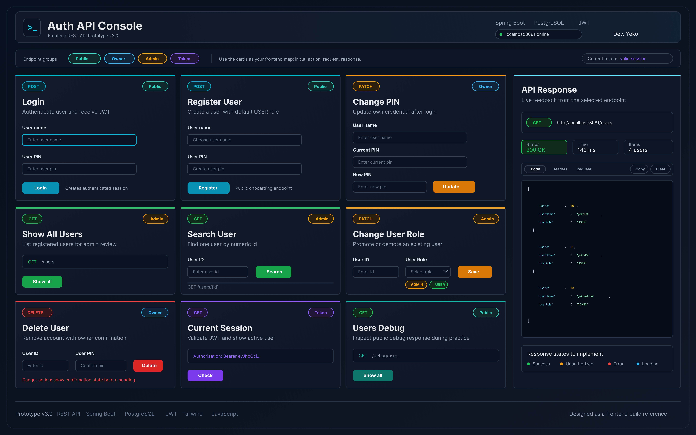

# Login API v2.3 - Mini Frontend Console

Backend REST API built with **Java 17**, **Spring Boot 4**, **Spring JDBC / JdbcTemplate**, **JWT**, **BCrypt**, and a relational database.

This branch is **v2.3-mini-frontend** of the Login API project.

The goal of this version is to keep the backend from v2 stable and add a small but functional frontend console for testing the REST API from the browser.

---

## Project overview

This project is a learning-focused authentication API with a browser frontend.

It includes:

- A Spring Boot backend with JWT authentication
- BCrypt PIN hashing
- Role-based access control with `USER` and `ADMIN`
- Owner-only account actions
- Admin-only user management actions
- A Vite + Tailwind + JavaScript frontend console
- A response panel that shows live API feedback

The frontend is not meant to be a production UI yet. It is a practical API console used to test and understand the request flow.

---

## Frontend preview

Frontend UI prototype / console layout:



The frontend contains cards for:

- Login
- Register user
- Change PIN
- Show all users as admin
- Search user by ID
- Change user role
- Delete user
- Current session
- Public users debug endpoint

Each card represents one backend request: input, action, request, and response.

---

## What changed in v2.3

- Added a browser-based frontend API console
- Added Tailwind styling through Vite
- Added a backend status indicator for `localhost:8081`
- Added current token status in the sub-header
- Added cards for public, owner, admin, and token-based endpoints
- Added a right-side API response panel
- Added response status, response time, current access-level display, and response body preview
- Added Body / Headers / Request tabs for inspecting requests and responses
- Added copy and clear controls for the response panel
- Added public `/users` debug card for development testing
- Kept the backend behavior from v2 stable

---

## Backend features

- User registration
- Login with JWT
- BCrypt PIN hashing
- `Authorization: Bearer <token>` authentication
- `USER` and `ADMIN` roles
- Admin-only endpoints
- Account-owner-only endpoints
- Current session endpoint
- DTO validation with `@Valid` and `@NotBlank`
- Role checks resolved from the database in real time
- JdbcTemplate-based persistence
- PostgreSQL support
- MariaDB/XAMPP local testing compatibility

---

## Frontend features

- Vite frontend running separately from the backend
- Tailwind-based dark UI
- API request cards grouped by endpoint type
- Backend online/offline indicator
- Current token indicator
- API response panel with:
    - HTTP method
    - Request URL
    - HTTP status
    - Response time
    - Current logged-in access level
    - Response body
    - Request payload preview
    - Request/response headers preview
- Local JavaScript state for:
    - `currentToken`
    - `currentUserId`
    - `currentUserRole`
    - last API response
    - last request

Important note: the frontend stores session information only in JavaScript variables for this version. It is enough for learning and testing, but not a final production session strategy.

---

## Technologies

### Backend

- Java 17
- Spring Boot 4.0.6
- Spring Web MVC
- Spring JDBC / JdbcTemplate
- PostgreSQL
- BCrypt via `spring-security-crypto`
- JWT with JJWT
- Maven
- IntelliJ IDEA HTTP Client

### Frontend

- HTML
- JavaScript
- Vite
- Tailwind CSS

---

## Database

Main PostgreSQL table:

```sql
CREATE TABLE users
(
    user_id   serial PRIMARY KEY,
    user_name varchar(100) NOT NULL UNIQUE,
    user_pin  varchar(255) NOT NULL,
    user_role varchar(20) DEFAULT 'USER' NOT NULL
);
```

MariaDB/MySQL version for local school/XAMPP testing:

```sql
CREATE TABLE users
(
    user_id   BIGINT PRIMARY KEY AUTO_INCREMENT,
    user_name varchar(100) NOT NULL UNIQUE,
    user_pin  varchar(255) NOT NULL,
    user_role varchar(20) DEFAULT 'USER' NOT NULL
);
```

### Columns

| Column      | Description                  |
|-------------|------------------------------|
| `user_id`   | Unique user id               |
| `user_name` | Unique username              |
| `user_pin`  | BCrypt-hashed PIN            |
| `user_role` | User role: `USER` or `ADMIN` |

---

## Configuration

The real `application.properties` is ignored by Git because it contains local database credentials and JWT secrets.

Use `application-example.properties` as a template and create your own local file:

```text
src/main/resources/application.properties
```

Example for PostgreSQL:

```properties
spring.application.name=login-api
server.port=8081

spring.datasource.url=jdbc:postgresql://localhost:5432/data_base_name
spring.datasource.username=postgres
spring.datasource.password=postgres

jwt.secret=secret-key
jwt.duration-millis=1800000
```

Example for MariaDB/XAMPP local testing:

```properties
spring.application.name=login-api
server.port=8081

spring.datasource.url=jdbc:mariadb://localhost:3307/data_base_name
spring.datasource.username=root
spring.datasource.password=

jwt.secret=secret-key
jwt.duration-millis=1800000
```

---

## How to run

### 1. Start the backend

Run the Spring Boot application from IntelliJ or Maven.

Expected backend URL:

```text
http://localhost:8081
```

The frontend status pill checks the backend on `localhost:8081`.

### 2. Start the frontend

Go to the frontend folder and run Vite:

```bash
npm install
npm run dev
```

Expected frontend URL:

```text
http://localhost:5173
```

---

## Authentication flow

After login, the backend returns a JWT token.

Protected requests use this header:

```http
Authorization: Bearer <token>
```

The JWT identifies the user by `userId` and `userName`.

User roles are checked directly from the database, so role changes apply immediately even if an old token still exists.

---

## Endpoints

### Public endpoints

#### Create user

```http
POST /users
Content-Type: application/json
```

Request body:

```json
{
  "userName": "yeko",
  "userPin": "1234"
}
```

Response example:

```json
{
  "userId": 1,
  "userName": "yeko",
  "userRole": "USER"
}
```

New users are created with the default role `USER`.

---

#### Login

```http
POST /auth/login
Content-Type: application/json
```

Request body:

```json
{
  "userName": "yeko",
  "userPin": "1234"
}
```

Response example:

```json
{
  "token": "<jwt-token>",
  "userId": 1,
  "userName": "yeko",
  "userRole": "USER"
}
```

---

#### Public debug users

```http
GET /users
```

This endpoint is currently public for development/debugging.

It can be used to quickly verify that the frontend, backend, and database connection are working.

---

### Authenticated endpoint

#### Get current session

```http
GET /auth/session
Authorization: Bearer <token>
```

Returns the current user based on the active token.

Response example:

```json
{
  "userId": 1,
  "userName": "yeko",
  "userRole": "USER"
}
```

---

### Admin endpoints

#### Get all users as admin

```http
GET /admin/users
Authorization: Bearer <admin-token>
```

Requires role:

```text
ADMIN
```

Response example:

```json
[
  {
    "userId": 1,
    "userName": "yeko",
    "userRole": "USER"
  },
  {
    "userId": 2,
    "userName": "admin",
    "userRole": "ADMIN"
  }
]
```

---

#### Get user by id

```http
GET /users/{id}
Authorization: Bearer <admin-token>
```

Requires role:

```text
ADMIN
```

Response example:

```json
{
  "userId": 1,
  "userName": "yeko",
  "userRole": "USER"
}
```

---

#### Update user role

```http
PATCH /admin/users/{id}/role
Authorization: Bearer <admin-token>
Content-Type: application/json
```

Request body:

```json
{
  "userRole": "ADMIN"
}
```

Allowed roles:

```text
USER
ADMIN
```

The API normalizes role input:

```text
" admin " → "ADMIN"
"user"    → "USER"
```

The API does not allow changing the last remaining `ADMIN` to `USER`.

Response example:

```json
{
  "message": "Role Updated"
}
```

---

### Account owner endpoints

These endpoints require that the token belongs to the same user id in the URL.

#### Update own PIN

```http
PATCH /users/{id}/pin
Authorization: Bearer <token>
Content-Type: application/json
```

Request body:

```json
{
  "userName": "yeko",
  "userPin": "1234",
  "newUserPin": "9999"
}
```

Response example:

```json
{
  "message": "Password Updated"
}
```

---

#### Delete own account

```http
DELETE /users/{id}
Authorization: Bearer <token>
Content-Type: application/json
```

Request body:

```json
{
  "userName": "yeko",
  "userPin": "9999"
}
```

Response example:

```json
{
  "message": "User yeko Deleted"
}
```

---

## Error response

Most denied requests return:

```json
{
  "message": "Access Denied"
}
```

Common status codes currently used:

| Status                      | Meaning                                                  |
|-----------------------------|----------------------------------------------------------|
| `200 OK`                    | Successful request                                       |
| `201 Created`               | User created successfully                                |
| `400 Bad Request`           | Invalid request, for example username already exists     |
| `401 Unauthorized`          | Login/session/account-owner check failed                 |
| `403 Forbidden`             | User is authenticated but does not have admin permission |
| `404 Not Found`             | Requested resource was not found                         |
| `409 Conflict`              | Invalid/conflicting data                                 |
| `500 Internal Server Error` | Unexpected server/database error                         |

Validation errors are handled by Spring validation using DTO annotations like `@NotBlank`.

---

## Project structure

Backend structure:

```text
controller
├── AuthController
└── UserController

service
├── AuthService
├── JwtService
├── PasswordService
└── UserService

repository
└── UserRepository

dto
├── ApiMessage
├── CreateUserRequest
├── DeleteUserRequest
├── LoginRequest
├── LoginResponse
├── UpdatePinRequest
├── UpdateRoleRequest
└── UserResponse

entity
└── User

exception
└── GlobalExceptionHandler
```

Frontend structure:

```text
frontend
├── index.html
├── package.json
├── public
│   ├── background.png
│   └── ux-ui-prototype
│       └── auth-api-console-redesign.png
└── src
    ├── main.js
    └── style.css
```

---

## Repository layer in v2

`UserRepository` uses `JdbcTemplate`.

Examples of the current style:

```text
SELECT returning multiple rows
→ jdbcTemplate.query(...)

SELECT returning one guaranteed value
→ jdbcTemplate.queryForObject(...)

INSERT / UPDATE / DELETE
→ jdbcTemplate.update(...)
```

The repository has separate mapping methods for:

```text
full user
→ includes user_pin/hash for internal authentication

public user
→ excludes user_pin/hash for API responses
```

DTO conversion is handled in the service layer, not in the repository.

---

## Security notes

- User PINs are never stored as plain text.
- PINs are hashed with BCrypt.
- JWT tokens are signed with a secret from local `application.properties`.
- Admin permissions are checked against the current database role, not only against token claims.
- Role changes take effect immediately for protected admin endpoints.
- The token contains identity data such as `userId` and `userName`, but role permissions are resolved from the database.
- `application.properties` is ignored by Git to avoid committing local credentials and secrets.
- The current frontend is a development/testing console, not a production authentication frontend.

---

## Current project status

This is **v2.3-mini-frontend**.

Completed:

- Backend v2 JdbcTemplate refactor
- JWT login/session flow
- Admin and owner endpoint testing
- Public debug endpoint testing
- Mini frontend API console
- Tailwind/Vite frontend setup
- Live backend status indicator
- Current token indicator
- API response panel
- Basic request/response inspection in the browser

Completed v2.3 goal:

```text
Backend API only
→ Backend API + functional mini frontend console
```

Planned future improvements:

- Refactor repeated frontend JavaScript into reusable helper functions
- Improve responsive layout for smaller screens
- Add better loading states during requests
- Improve form validation before sending requests
- Add more consistent frontend error messages
- Add localStorage/sessionStorage support if needed
- Add unit and integration tests
- Add Docker setup
- Add deployment setup
- Later: Spring Security filter-based authentication
