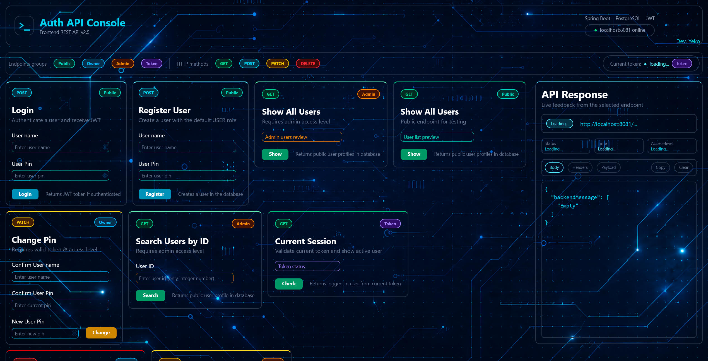
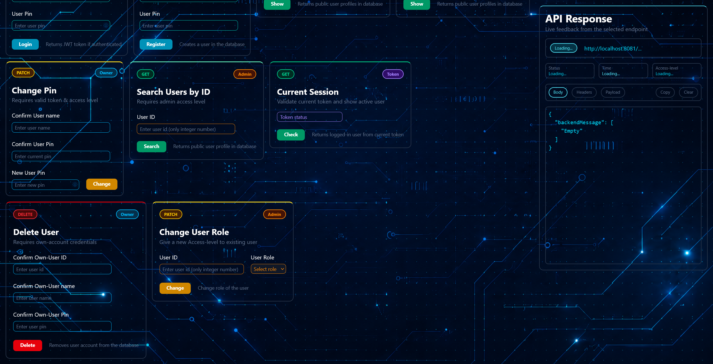

# Login API v3.0 — Fullstack Authentication Console


A learning-focused fullstack authentication project built with **Java 17**, **Spring Boot 4**, **Spring Data JPA / Hibernate**, **JWT**, **BCrypt**, **React**, **Vite**, **Tailwind CSS**, and **SQL databases**.

The project combines a Spring Boot REST API with a React-based API console for testing authentication, authorization, role-based access, request/response flows, frontend validation, and database persistence.

> Current branch: `v3.0-frontend-react-migration`

---

## Table of contents

- [Project overview](#project-overview)
- [Frontend preview](#frontend-preview)
- [What this project demonstrates](#what-this-project-demonstrates)
- [Main features](#main-features)
- [Tech stack](#tech-stack)
- [Architecture overview](#architecture-overview)
- [Project structure](#project-structure)
- [Database](#database)
- [Local setup](#local-setup)
- [Run the project](#run-the-project)
- [Authentication and authorization flow](#authentication-and-authorization-flow)
- [Endpoint overview](#endpoint-overview)
- [Response format](#response-format)
- [Manual test flow](#manual-test-flow)
- [Security notes](#security-notes)
- [Version history](#version-history)
- [Current status](#current-status)
- [Possible future improvements](#possible-future-improvements)
- [Learning purpose](#learning-purpose)

---

## Project overview

**Login API v3.0** is a fullstack learning project focused on building and understanding an authentication system from backend to frontend.

The backend provides a REST API for:

- user registration
- login with JWT
- current-session validation
- owner-only actions
- administrator-only actions
- role updates
- PIN updates
- account deletion

The frontend is a React API console that allows testing every endpoint through visual cards. It shows the outgoing request, response body, headers, payload, HTTP status, response time, access level, token status, and frontend validation feedback.

This project is not meant to be a production authentication system. It is meant to document a practical learning path through backend development, frontend state management, API communication, security basics, and fullstack architecture.

---

## Frontend preview

The interface contains endpoint cards on the left and a live API response inspector on the right.

<p align="center">
  
</p>

<p align="center">
  
</p>

The React frontend provides cards for:

- Login
- Register user
- Current session
- Change PIN
- Show all users as public/debug endpoint
- Show all users as admin
- Search user by ID as admin
- Change user role as admin
- Delete own account

---

## What this project demonstrates

This repository shows more than a single finished result. It documents an incremental fullstack learning process:

- backend persistence migrated from earlier manual approaches to **Spring Data JPA**
- API responses cleaned up through DTOs and projections
- frontend migrated from **Vanilla JavaScript** to **React**
- fetch logic centralized into reusable request helpers
- repeated frontend checks extracted into reusable guards
- authentication state extracted into session helpers
- response panel improved with masking, copy, clear, and token feedback

For a junior fullstack / FIAE internship context, the project demonstrates that I can work through a real application step by step, refactor working code, and explain decisions across backend, frontend, database, and UI behavior.

---

## Main features

### Backend

- User registration
- JWT login
- Current-session validation
- BCrypt PIN hashing
- `USER` and `ADMIN` roles
- Administrator-only endpoints
- Account-owner-only endpoints
- Runtime authorization checks against the current database role
- DTO validation with Jakarta Validation
- Global validation and database exception handling
- Spring Data JPA persistence
- Public DTO projections that avoid exposing PIN hashes
- PostgreSQL support
- MariaDB / MySQL compatibility for local testing
- Protection against downgrading the last remaining administrator

### Frontend

- React + Vite + Tailwind CSS interface
- Endpoint cards grouped by access type: Public, Owner, Admin, and Token
- In-memory authentication session
- Current token indicator
- Current access-level indicator
- Live backend online/offline indicator
- Centralized request preparation
- Centralized fetch execution
- Centralized fetch error handling
- Reusable frontend guards
- Reusable session helpers
- Response panel with:
  - Body view
  - Headers view
  - Payload view
  - HTTP method badge
  - URL display
  - HTTP status display
  - response time display
  - access-level display
- Copy and clear controls
- Token copy button
- Temporary UI feedback popups such as `Copied`, `Cleared`, `Token copied`, and `No token`
- Masked PIN values in request payload previews
- Masked JWT values in request/response previews

---

## Tech stack

### Backend

- Java 17
- Spring Boot 4.0.6
- Spring Web MVC
- Spring Data JPA
- Hibernate
- Jakarta Validation
- PostgreSQL driver
- MariaDB Java client
- BCrypt through `spring-security-crypto`
- JJWT 0.12.6
- Maven

### Frontend

- React 19
- JavaScript
- Vite 8
- Tailwind CSS 4
- Fetch API
- React `useState`
- React `useEffect`
- Clipboard API

### Database

- PostgreSQL
- MariaDB / MySQL

---

## Architecture overview

```text
React API Console
        │
        │ Fetch API
        ▼
Spring Boot REST API
        │
        │ Service layer
        ▼
Spring Data JPA / Hibernate
        │
        ▼
PostgreSQL / MariaDB / MySQL
```

### Backend layers

```text
controller/   → REST endpoints and HTTP responses
service/      → authentication, authorization, user logic
repository/   → Spring Data JPA repository methods and custom queries
entity/       → JPA entity mapping
dto/          → request and response objects
exception/    → global exception handling
```

### Frontend layers

```text
components/   → UI cards, layout, header, response panel
utils/        → request helpers, guards, response helpers, session helpers
App.jsx       → global frontend state and backend status check
main.jsx      → React entry point
style.css     → Tailwind import and global styles
```

---

## Project structure

```text
Login-API/
├── backend/
│   ├── .mvn/
│   ├── src/
│   │   ├── main/
│   │   │   ├── java/org/yeko/loginapi/
│   │   │   │   ├── controller/
│   │   │   │   │   ├── AuthController.java
│   │   │   │   │   └── UserController.java
│   │   │   │   ├── dto/
│   │   │   │   ├── entity/
│   │   │   │   ├── exception/
│   │   │   │   ├── repository/
│   │   │   │   ├── service/
│   │   │   │   └── LoginApiApplication.java
│   │   │   └── resources/
│   │   │       └── application-example.properties
│   │   └── test/
│   ├── pom.xml
│   ├── mvnw
│   ├── mvnw.cmd
│   └── requests.http
│
├── frontend/
│   ├── public/
│   │   ├── background.png
│   │   └── ux-ui-prototype/
│   ├── src/
│   │   ├── components/
│   │   │   ├── ChangePinCard.jsx
│   │   │   ├── ChangeUserRoleCard.jsx
│   │   │   ├── CurrentSessionCard.jsx
│   │   │   ├── DeleteUserCard.jsx
│   │   │   ├── Header.jsx
│   │   │   ├── LoginCard.jsx
│   │   │   ├── MainLayout.jsx
│   │   │   ├── RegisterUserCard.jsx
│   │   │   ├── ResponsePanel.jsx
│   │   │   ├── SearchUserByIdCard.jsx
│   │   │   ├── ShowAllUsersAdminCard.jsx
│   │   │   ├── ShowAllUsersPublicCard.jsx
│   │   │   └── SubHeader.jsx
│   │   ├── utils/
│   │   │   ├── apiRequestHelpers.js
│   │   │   ├── guards.js
│   │   │   ├── responsePanelHelpers.js
│   │   │   └── sessionHelpers.js
│   │   ├── App.jsx
│   │   ├── main.jsx
│   │   ├── legacy-main.js
│   │   └── style.css
│   ├── index.html
│   ├── legacy-index.html
│   ├── package.json
│   ├── package-lock.json
│   └── vite.config.js
│
├── docs/
│   └── screenshots/
├── README.md
├── .gitignore
└── .gitattributes
```

---

## Database

### PostgreSQL

```sql
CREATE TABLE users
(
    user_id   serial PRIMARY KEY,
    user_name varchar(100) NOT NULL UNIQUE,
    user_pin  varchar(255) NOT NULL,
    user_role varchar(20) DEFAULT 'USER' NOT NULL
);
```

### MariaDB / MySQL

```sql
CREATE TABLE users
(
    user_id   BIGINT PRIMARY KEY AUTO_INCREMENT,
    user_name varchar(100) NOT NULL UNIQUE,
    user_pin  varchar(255) NOT NULL,
    user_role varchar(20) DEFAULT 'USER' NOT NULL
);
```

The API does not return the stored PIN hash in public user responses. Public user reads use DTO projections that select only:

```text
userId
userName
userRole
```

---

## Local setup

### Requirements

- Java 17
- Maven or the included Maven Wrapper
- Node.js and npm
- PostgreSQL, MariaDB, or MySQL
- IntelliJ IDEA or another Java IDE
- A local database named for example `login_app_db`

### Backend configuration

The real `application.properties` file is ignored by Git because it contains database credentials and the JWT secret.

Create:

```text
backend/src/main/resources/application.properties
```

Example for PostgreSQL:

```properties
spring.application.name=login-api
server.port=8081

spring.datasource.url=jdbc:postgresql://localhost:5432/login_app_db
spring.datasource.username=postgres
spring.datasource.password=your-password

spring.jpa.open-in-view=false

jwt.secret=replace-with-a-secret-of-at-least-32-bytes
jwt.duration-millis=1800000
```

Example for MariaDB:

```properties
spring.application.name=login-api
server.port=8081

spring.datasource.url=jdbc:mariadb://localhost:3307/login_app_db
spring.datasource.username=root
spring.datasource.password=

spring.jpa.open-in-view=false

jwt.secret=replace-with-a-secret-of-at-least-32-bytes
jwt.duration-millis=1800000
```

Do not commit real database credentials or the real JWT secret.

---

## Run the project

### 1. Start the backend

From the backend folder:

```bash
cd backend
./mvnw spring-boot:run
```

On Windows PowerShell:

```powershell
cd backend
.\mvnw.cmd spring-boot:run
```

Backend URL:

```text
http://localhost:8081
```

### 2. Start the frontend

From the frontend folder:

```bash
cd frontend
npm install
npm run dev
```

Frontend URL:

```text
http://localhost:5173
```

The backend currently allows the Vite development origin through CORS:

```text
http://localhost:5173
```

---

## Authentication and authorization flow

1. A user registers with a username and PIN.
2. The backend hashes the PIN with BCrypt.
3. A successful login returns a signed JWT.
4. The React frontend stores the token, user ID, and role in memory.
5. Protected requests send:

```http
Authorization: Bearer <token>
```

6. The token identifies the authenticated user.
7. Authorization checks compare the token user with the current database role.
8. Owner endpoints require the authenticated user to match the target account ID.
9. Admin endpoints require the current database role to be `ADMIN`.
10. Refreshing the page clears the frontend session because the token is not persisted in local storage.

---

## Endpoint overview

| Access         | Method   | Endpoint                 | Purpose                                        |
|----------------|----------|--------------------------|------------------------------------------------|
| Public         | `POST`   | `/users`                 | Register a user                                |
| Public         | `POST`   | `/auth/login`            | Login and receive a JWT                        |
| Public / Debug | `GET`    | `/users`                 | List public user profiles                      |
| Token          | `GET`    | `/auth/session`          | Validate the token and return the current user |
| Admin          | `GET`    | `/admin/users`           | List all public user profiles as admin         |
| Admin          | `GET`    | `/users/{id}`            | Find a public user profile by ID               |
| Admin          | `PATCH`  | `/admin/users/{id}/role` | Change a user's role                           |
| Owner          | `PATCH`  | `/users/{id}/pin`        | Change the authenticated owner's PIN           |
| Owner          | `DELETE` | `/users/{id}`            | Delete the authenticated owner's account       |

### Register

```http
POST /users
Content-Type: application/json
```

```json
{
  "userName": "yeko",
  "userPin": "1234"
}
```

Successful response:

```json
{
  "userId": 1,
  "userName": "yeko",
  "userRole": "USER"
}
```

### Login

```http
POST /auth/login
Content-Type: application/json
```

```json
{
  "userName": "yeko",
  "userPin": "1234"
}
```

Successful response:

```json
{
  "token": "<jwt-token>",
  "userId": 1,
  "userName": "yeko",
  "userRole": "USER"
}
```

### Current session

```http
GET /auth/session
Authorization: Bearer <token>
```

Successful response:

```json
{
  "userId": 1,
  "userName": "yeko",
  "userRole": "USER"
}
```

### Change PIN

```http
PATCH /users/{id}/pin
Authorization: Bearer <token>
Content-Type: application/json
```

```json
{
  "userName": "yeko",
  "userPin": "1234",
  "newUserPin": "5678"
}
```

Successful response:

```json
{
  "backendMessage": [
    "Password Updated"
  ]
}
```

### Change role

```http
PATCH /admin/users/{id}/role
Authorization: Bearer <admin-token>
Content-Type: application/json
```

```json
{
  "userRole": "ADMIN"
}
```

Successful response:

```json
{
  "backendMessage": [
    "Role Updated"
  ]
}
```

### Delete own account

```http
DELETE /users/{id}
Authorization: Bearer <token>
Content-Type: application/json
```

```json
{
  "userName": "yeko",
  "userPin": "1234"
}
```

Successful response:

```json
{
  "backendMessage": [
    "User Deleted"
  ]
}
```

---

## Response format

Operations that return text messages use a consistent field with a list of message lines:

```json
{
  "backendMessage": [
    "Password Updated"
  ]
}
```

Some responses may include multiple backend message lines:

```json
{
  "backendMessage": [
    "User data conflict",
    "Try again"
  ]
}
```

The frontend can extend a successful or blocked response with its own UI feedback:

```json
{
  "backendMessage": [
    "Password Updated"
  ],
  "frontendMessage": [
    "Login is required",
    "Please login again with the new PIN"
  ]
}
```

Frontend-only blocked requests use the same response panel structure, for example when a user is not logged in, is not an admin, submits empty fields, or enters an invalid ID.

---

## Response status codes

| Status                      | Meaning                                               |
|----------------------------:|-------------------------------------------------------|
|                         `0` | Frontend fetch/network failure                        |
|                    `200 OK` | Successful request                                    |
|               `201 Created` | User created successfully                             |
|           `400 Bad Request` | Invalid request, validation error, or invalid user ID |
|          `401 Unauthorized` | Missing or invalid login/session                      |
|             `403 Forbidden` | Authenticated user lacks permission                   |
|             `404 Not Found` | Requested user was not found                          |
|              `409 Conflict` | Conflicting data, such as an existing username        |
| `500 Internal Server Error` | Unexpected backend or database error                  |

---

## Manual test flow

A basic manual smoke test can be done from the React frontend:

1. Start backend and frontend.
2. Check that the backend indicator changes to online.
3. Register a new user.
4. Login with the new user.
5. Copy the token from the SubHeader token button.
6. Validate the current session.
7. Try admin-only actions as normal `USER` and confirm `403`.
8. Login as an admin user.
9. Show all users as admin.
10. Search user by ID.
11. Change another user's role.
12. Change the current user's own role and verify the session reset.
13. Change the current user's PIN and verify the session reset.
14. Login again with the new PIN.
15. Delete the current user's own account and verify the session reset.
16. Stop the backend and confirm the frontend shows fetch failure feedback.

---

## Security notes

- PINs are hashed with BCrypt and are never stored as plain text.
- PIN hashes are not included in public API responses.
- Public user read queries use DTO projections and do not select `userPin`.
- JWT secrets and database credentials belong only in the ignored local configuration file.
- Administrator permissions are checked against the current database role.
- Owner actions verify that the authenticated user matches the target account.
- The last remaining administrator cannot be downgraded to `USER`.
- PINs are masked in the frontend payload preview.
- JWT values are masked in the response panel and request header preview.
- The real JWT can only be copied from the token button after login.
- The frontend stores the session only in memory, not in local storage.
- The public `GET /users` endpoint exists for development/debugging and should be protected or removed before production.
- This project uses custom JWT authorization logic for learning purposes and is not presented as production-ready authentication infrastructure.

---

## Version history

### v2.6 — Project structure

Version 2.6 reorganized the repository into a clearer fullstack structure.

- Moved the Spring Boot application into `backend/`
- Kept the Vite frontend inside `frontend/`
- Centralized shared repository files in the project root
- Updated the project layout to better represent a fullstack monorepo
- Kept backend and frontend as independent runnable projects

### v2.7 — JPA migration

Version 2.7 migrated the backend persistence layer from `JdbcTemplate` to **Spring Data JPA**.

- Added `spring-boot-starter-data-jpa`
- Converted `User` into a JPA entity with `@Entity`, `@Table`, `@Id`, and `@Column`
- Replaced manual repository methods with `JpaRepository`
- Migrated common CRUD operations to JPA methods such as `findAll`, `findById`, `save`, and `delete`
- Added Spring Data query methods such as `findByUserName` and `countByUserRole`
- Removed the old `JdbcTemplate` repository after the migration was complete

### v2.8 — JPA polish

Version 2.8 cleaned up and improved the new JPA backend.

- Renamed the JPA repository back to `UserRepository` after removing the old JDBC implementation
- Removed the unused direct JDBC starter dependency
- Disabled `spring.jpa.open-in-view`
- Added database exception handling through `GlobalExceptionHandler`
- Changed `ApiMessage` to support multiple backend message lines with `List<String>`
- Simplified user creation by returning `UserResponse` directly
- Added DTO projections for public user reads so public responses do not load `userPin`
- Added a specific role-update query with `@Modifying`
- Added role constants and valid-role handling for cleaner role validation

### v3.0 — React frontend migration

Version 3.0 migrated the frontend from **Vanilla JavaScript** to **React** while keeping the same API testing workflow.

- Rebuilt the frontend using React components
- Migrated endpoint cards into component-based UI modules
- Added `App.jsx` state for backend status, authentication session, and response panel state
- Added `MainLayout.jsx` to organize endpoint cards and the response panel
- Added reusable request helpers for preparing requests and executing fetch calls
- Added centralized fetch error handling
- Added reusable frontend guards for empty inputs, login checks, admin checks, and positive integer validation
- Added session helpers for login and session reset behavior
- Added response panel helpers for frontend messages and blocked requests
- Added request/response masking for PINs and JWT values
- Added Copy, Clear, and Token copy feedback in the UI
- Kept Body, Headers, and Payload views in the response inspector

---

## Current status

### Completed in v3.0

- Backend authentication and authorization flow
- BCrypt PIN protection
- JWT login and session validation
- Spring Data JPA persistence layer
- DTO projections for public user responses
- Public, owner, administrator, and token endpoints
- React frontend migration
- Component-based endpoint cards
- Centralized frontend request helpers
- Centralized fetch error handling
- Reusable frontend guards
- Reusable session helpers
- Live request and response inspection
- Response panel Body, Headers, and Payload views
- PIN and token masking in the UI
- Copy, Clear, and Token feedback controls
- Fullstack repository structure with separate `backend/` and `frontend/` folders

---

## Possible future improvements

- Move the API base URL into a frontend config or environment variable
- Extract repeated UI elements into reusable components such as `Card`, `Input`, `Button`, and `Badge`
- Improve responsive layout for smaller screens
- Add loading and disabled-button states during requests
- Add automated backend tests
- Add frontend component or integration tests
- Add Docker configuration
- Add deployment configuration
- Add a production profile and environment-based CORS settings
- Consider Spring Security filter-chain integration
- Consider a role enum instead of string-based roles
- Protect or remove the public debug `/users` endpoint before production

---

## Learning purpose

This repository documents my progress while learning backend and fullstack development.

The goal is to understand each layer directly:

- database design
- JPA persistence
- REST API design
- DTO validation
- authentication with JWT
- authorization rules
- frontend state management
- Fetch API requests
- frontend validation
- UI feedback
- request/response inspection
- incremental refactoring

The project intentionally evolved through multiple stages. It started with simpler approaches, moved through JDBC-based persistence, then migrated to Spring Data JPA, and finally migrated the frontend from Vanilla JavaScript to React.

That evolution is part of the purpose of the repository: it shows both the working application and the learning process behind it.
