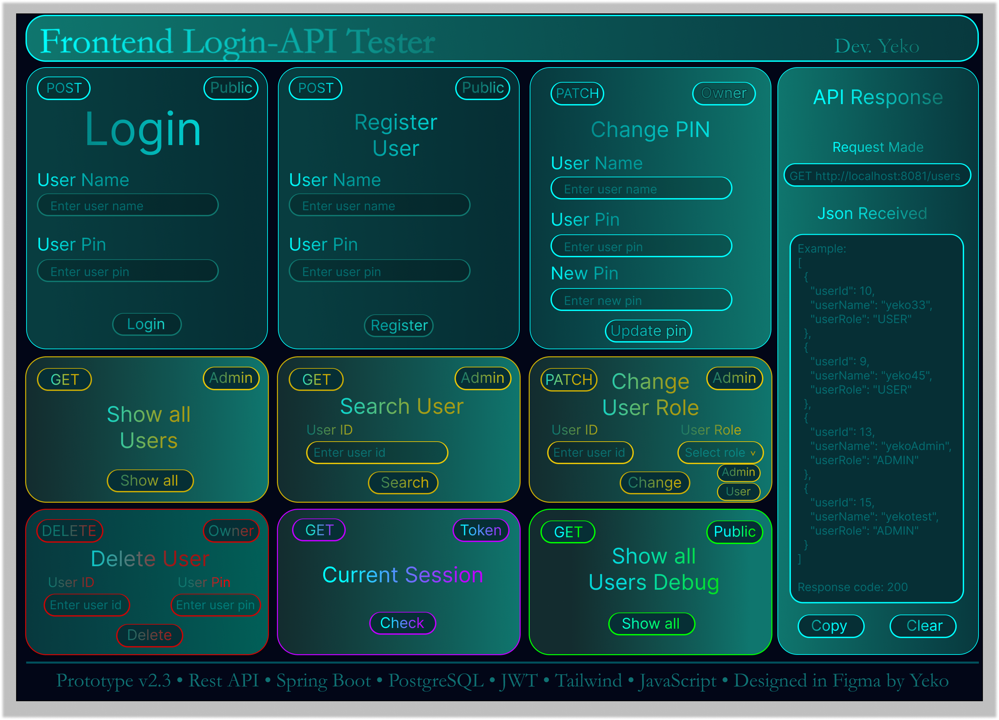

# Login API v2 - JdbcTemplate Refactor

Backend REST API built with **Java 17**, **Spring Boot 4**, **Spring JDBC / JdbcTemplate**, **JWT**, **BCrypt**, and a relational database.

This branch is **version 2** of the Login API.  
The main goal of this version was to refactor the repository layer from manual JDBC code to **Spring JdbcTemplate**, while keeping the same API behavior from v1.

## Frontend UI Prototype

Initial frontend prototype designed in Figma before implementing the HTML, Tailwind CSS, and JavaScript frontend.



## What changed in v2

- Replaced manual JDBC code (`DataSource`, `Connection`, `PreparedStatement`, `ResultSet`) with **JdbcTemplate**
- Removed manual connection handling from `UserRepository`
- `SELECT` methods now use `jdbcTemplate.query(...)` or `queryForObject(...)`
- `INSERT`, `UPDATE`, and `DELETE` methods now use `jdbcTemplate.update(...)`
- `createUser(...)` was changed to work with both PostgreSQL and MariaDB/MySQL-style local testing
- Repository code is shorter and easier to maintain
- API behavior remains the same as v1

## Features

- User registration
- Login with JWT
- BCrypt PIN hashing
- `Authorization: Bearer <token>` authentication
- `USER` and `ADMIN` roles
- Admin-only endpoints
- Account-owner-only endpoints
- Role validation
- Current session endpoint
- DTO validation with `@Valid` and `@NotBlank`
- Role checks are resolved from the database in real time

## Technologies

- Java 17
- Spring Boot 4.0.6
- Spring Web MVC
- Spring JDBC / JdbcTemplate
- PostgreSQL
- MariaDB
- BCrypt via `spring-security-crypto`
- JWT with JJWT
- Maven
- IntelliJ IDEA HTTP Client for endpoint testing

## Database

Main table:

```sql
CREATE TABLE users
(
    user_id   serial PRIMARY KEY,
    user_name varchar(100) NOT NULL UNIQUE,
    user_pin  varchar(255) NOT NULL,
    user_role varchar(20) DEFAULT 'USER' NOT NULL
);
```

For MariaDB/MySQL the table can be adapted with an auto-increment id:

```sql
CREATE TABLE users
(
    user_id   BIGINT PRIMARY KEY AUTO_INCREMENT,
    user_name varchar(100) NOT NULL UNIQUE,
    user_pin  varchar(255) NOT NULL,
    user_role varchar(20) DEFAULT 'USER' NOT NULL
);
```

### Columns

| Column      | Description                    |
|-------------|--------------------------------|
| `user_id`   | Unique user id                 |
| `user_name` | Unique username                |
| `user_pin`  | BCrypt-hashed PIN              |
| `user_role` | User role: `USER` or `ADMIN`   |

## Configuration

The real `application.properties` is ignored by Git because it contains local database credentials and JWT secrets.

Use `application-example.properties` as a template and create your own local:

```text
src/main/resources/application.properties
```

Example for PostgreSQL:

```properties
spring.application.name=login-api
server.port=8081

spring.datasource.url=jdbc:postgresql://localhost:5432/data_base_name
spring.datasource.username=postgres
spring.datasource.password=postgres

jwt.secret=secret-key
jwt.duration-millis=1800000 (30minutes)
```

Example for MariaDB/XAMPP local testing:

```properties
spring.application.name=login-api
server.port=8081

spring.datasource.url=jdbc:mariadb://localhost:3307/data_base_name
spring.datasource.username=root
spring.datasource.password=

jwt.secret=secret-key
jwt.duration-millis=1800000 (30 minutes)
```

## Authentication

After login, the API returns a JWT token.

Protected endpoints require this header:

```http
Authorization: Bearer <token>
```

The JWT identifies the user by `userId` and `userName`.

User roles are checked directly from the database, so role changes apply immediately even if an old token still exists.

## Endpoints

### Public endpoints

#### Create user

```http
POST /users
Content-Type: application/json
```

Request body:

```json
{
  "userName": "yeko",
  "userPin": "1234"
}
```

Response example:

```json
{
  "userId": 1,
  "userName": "yeko",
  "userRole": "USER"
}
```

New users are created with the default role `USER`.

---

#### Login

```http
POST /auth/login
Content-Type: application/json
```

Request body:

```json
{
  "userName": "yeko",
  "userPin": "1234"
}
```

Response example:

```json
{
  "token": "<jwt-token>",
  "userId": 1,
  "userName": "yeko",
  "userRole": "USER"
}
```

---

### Authenticated endpoints

#### Get current session

```http
GET /auth/session
Authorization: Bearer <token>
```

Returns the current user based on the token.

Response example:

```json
{
  "userId": 1,
  "userName": "yeko",
  "userRole": "USER"
}
```

---

### Admin endpoints

#### Get all users

```http
GET /admin/users
Authorization: Bearer <admin-token>
```

Requires role:

```text
ADMIN
```

Response example:

```json
[
  {
    "userId": 1,
    "userName": "yeko",
    "userRole": "USER"
  },
  {
    "userId": 2,
    "userName": "admin",
    "userRole": "ADMIN"
  }
]
```

---

#### Get user by id

```http
GET /users/{id}
Authorization: Bearer <admin-token>
```

Requires role:

```text
ADMIN
```

Response example:

```json
{
  "userId": 1,
  "userName": "yeko",
  "userRole": "USER"
}
```

---

#### Update user role

```http
PATCH /admin/users/{id}/role
Authorization: Bearer <admin-token>
Content-Type: application/json
```

Request body:

```json
{
  "userRole": "ADMIN"
}
```

Allowed roles:

```text
USER
ADMIN
```

The API normalizes role input:

```text
" admin " → "ADMIN"
"user"    → "USER"
```

The API does not allow changing the last remaining `ADMIN` to `USER`.

Response example:

```json
{
  "message": "Role Updated"
}
```

---

### Account owner endpoints

These endpoints require that the token belongs to the same user id in the URL.

#### Update own PIN

```http
PATCH /users/{id}/pin
Authorization: Bearer <token>
Content-Type: application/json
```

Request body:

```json
{
  "userName": "yeko",
  "userPin": "1234",
  "newUserPin": "9999"
}
```

Response example:

```json
{
  "message": "Password Updated"
}
```

---

#### Delete own account

```http
DELETE /users/{id}
Authorization: Bearer <token>
Content-Type: application/json
```

Request body:

```json
{
  "userName": "yeko",
  "userPin": "9999"
}
```

Response example:

```json
{
  "message": "User yeko Deleted"
}
```

---

### Debug endpoint

#### Get all users without authentication

```http
GET /users
```

This endpoint is currently public for development/debugging.

It can be used to quickly verify that the application is connected to the database.

## Error response

Most denied requests return:

```json
{
  "message": "Access Denied"
}
```

Common status codes currently used:

| Status                      | Meaning                                                  |
|-----------------------------|----------------------------------------------------------|
| `200 OK`                    | Successful request                                       |
| `201 Created`               | User created successfully                                |
| `400 Bad Request`           | Invalid request, for example username already exists     |
| `401 Unauthorized`          | Login/session/account-owner check failed                 |
| `403 Forbidden`             | User is authenticated but does not have admin permission |
| `500 Internal Server Error` | Unexpected server/database error                         |

Validation errors are handled by Spring validation using DTO annotations like `@NotBlank`.

## Project structure

```text
controller
├── AuthController
└── UserController

service
├── AuthService
├── JwtService
├── PasswordService
└── UserService

repository
└── UserRepository

dto
├── ApiMessage
├── CreateUserRequest
├── DeleteUserRequest
├── LoginRequest
├── LoginResponse
├── UpdatePinRequest
├── UpdateRoleRequest
└── UserResponse

entity
└── User
```

## Repository layer in v2

`UserRepository` now uses `JdbcTemplate`.

Examples of the current style:

```text
SELECT returning multiple rows
→ jdbcTemplate.query(...)

SELECT returning one guaranteed value
→ jdbcTemplate.queryForObject(...)

INSERT / UPDATE / DELETE
→ jdbcTemplate.update(...)
```

The repository has separate mapping methods for:

```text
full user
→ includes user_pin/hash for internal authentication

public user
→ excludes user_pin/hash for API responses
```

DTO conversion is handled in the service layer, not in the repository.

## Security notes

- User PINs are never stored as plain text.
- PINs are hashed with BCrypt.
- JWT tokens are signed with a secret from local `application.properties`.
- Admin permissions are checked against the current database role, not only against token claims.
- Role changes take effect immediately for protected admin endpoints.
- The token contains identity data such as `userId` and `userName`, but role permissions are resolved from the database.
- `application.properties` is ignored by Git to avoid committing local credentials and secrets.

## Example authorization header

```http
Authorization: Bearer <jwt-token>
```

## Current project status

This is **version 2** of the Login API.

Implemented:

- User registration
- Login
- JWT generation and validation
- BCrypt PIN hashing
- Role-based authorization
- Admin endpoints
- Account owner endpoints
- Session endpoint
- JdbcTemplate-based persistence
- PostgreSQL support
- MariaDB local testing compatibility
- Local configuration through ignored `application.properties`

Completed v2 goal:

```text
Manual JDBC repository
→ Spring JdbcTemplate repository
```

Planned future improvements:

- Optional/helper cleanup for repository methods that may return no result
- Cleaner error response model
- More consistent HTTP status codes
- Spring Security filter-based authentication
- Refresh tokens
- Unit and integration tests
- Docker setup
- Deployment
- Optional frontend demo
